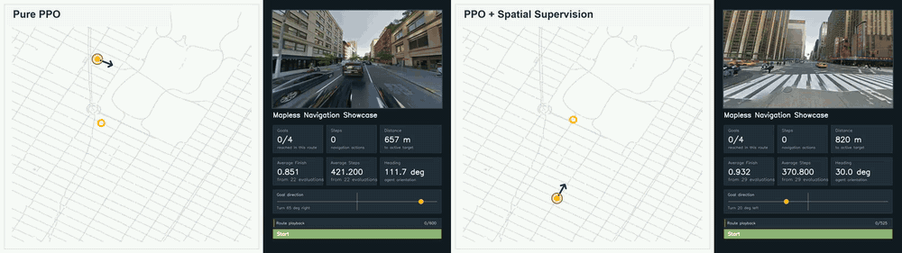
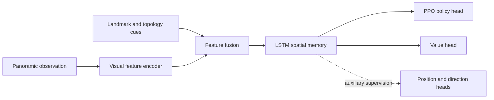
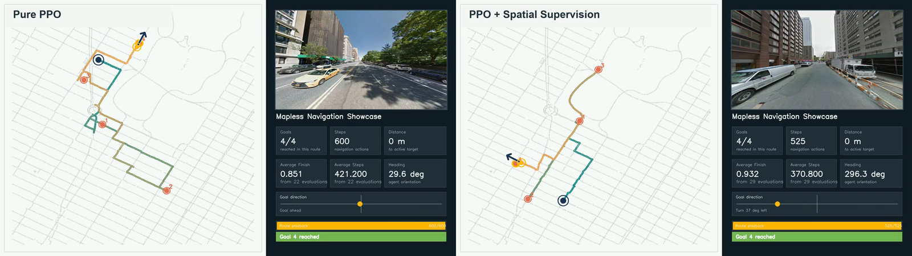
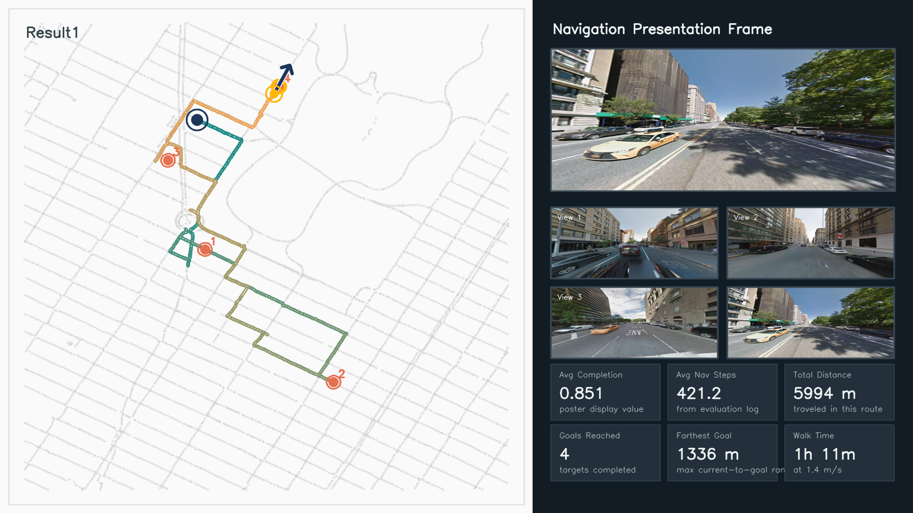
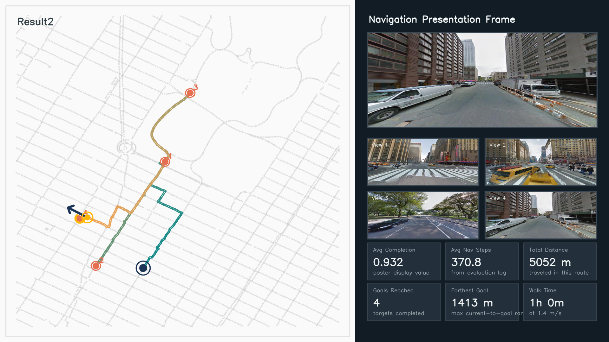

<div align="center">

# RL-Mapless

### City-scale visual navigation with PPO, recurrent memory, and spatial representation supervision

[](https://www.python.org/)
[](https://pytorch.org/)
[](#task)
[](licence)

**Navigate kilometer-scale urban environments from panoramic observations and landmark topology, without an explicit metric map or a precomputed global route.**

</div>

<p align="center">
  
</p>

<p align="center">
  <a href="docs/media/ppo-vs-spatial-supervision.mp4"><strong>Watch the full-resolution 52-second comparison</strong></a>
</p>

## Why this project

Most embodied-navigation benchmarks are demonstrated in rooms, buildings, or compact neighborhoods. RL-Mapless explores a harder question: can an agent form a useful internal representation of a city and navigate several kilometers using only what it sees and sparse topological cues?

The project studies two related objectives:

- **Navigation:** train a PPO agent to reach distant goals in Manhattan without consulting an explicit metric map at inference time.
- **Spatial cognition:** test whether auxiliary spatial supervision makes the recurrent latent state more geometrically meaningful and more useful for navigation.

The experimental environment contains **55,761 Manhattan panoramas**, covers approximately **4.72 km²**, and includes routes averaging roughly **4 km**.

> Here, *mapless* means that the policy does not receive an explicit metric map or a planned global route. Local street connectivity and landmark topology are still used to define feasible movement and goal context.

## Highlights

- City-scale navigation over real Manhattan street imagery
- Panoramic visual observations fused with landmark/topological features
- Recurrent PPO actor-critic policy with LSTM memory
- Auxiliary supervision for position, goal direction, and heading-aware spatial representations
- Direct comparison between pure PPO and spatially supervised PPO
- Qualitative route playback plus representation-level diagnostics

## Task

At each step, the agent observes a street panorama and landmark/topological context, maintains a recurrent hidden state, and selects a movement direction. The environment executes the closest feasible street transition and returns progress-based reward.



The auxiliary objectives are used during training to encourage the latent state to encode spatial relations. The policy itself still acts from learned features rather than reading coordinates from a map.

## Results

### Aggregate evaluation summary

| Model | Completion score (higher is better) | Average navigation steps (lower is better) | Logged evaluations |
|---|---:|---:|---:|
| Pure PPO | 0.851 | 421.2 | 22 |
| PPO + spatial representation supervision | **0.932** | **370.8** | 29 |
| Reported change | **+0.081 (+9.5%)** | **-50.4 (-12.0%)** | - |

Spatial supervision is associated with both a higher reported completion score and fewer navigation actions. Representation probes provide a more specific interpretation: absolute coordinate recovery does not clearly improve, while target-direction and heading awareness improve substantially. The learned feature space also shows stronger geometric consistency with physical distance.

<p align="center">
  
</p>

### Selected multi-goal rollouts

| Demonstration | Goals reached | Navigation actions | Traveled distance |
|---|---:|---:|---:|
| Pure PPO | 4 | 600 | 5,994 m |
| PPO + spatial representation supervision | 4 | **525** | **5,052 m** |

<table>
  <tr>
    <td width="50%"></td>
    <td width="50%"></td>
  </tr>
  <tr>
    <td align="center"><strong>Pure PPO</strong></td>
    <td align="center"><strong>PPO + spatial supervision</strong></td>
  </tr>
</table>

The aggregate values above reproduce the archived project presentation summaries. The two experiment folders contain different numbers of evaluation records, and the displayed routes are selected successful rollouts. The comparison should therefore be read as project-level experimental evidence rather than a standardized public leaderboard result.

## Model overview

1. **Visual encoding:** panoramic street views are converted to compact visual features with a frozen image backbone or a cached feature loader.
2. **Context encoding:** landmark and topological observations are projected into the policy feature space.
3. **Temporal integration:** an LSTM accumulates motion and spatial context across the route.
4. **Decision making:** PPO jointly optimizes the actor and value heads.
5. **Spatial supervision:** optional auxiliary heads decode position and directional relations from the latent state during training.

## Repository guide

| File | Role |
|---|---|
| `Mapless/main_.py` | Experiment configuration and entry point |
| `Mapless/exp.py` | PPO rollout, optimization, training, and evaluation |
| `Mapless/agent.py` | Recurrent actor-critic agent and auxiliary prediction heads |
| `Mapless/agent_comp.py` | Agent/input ablations used for comparison experiments |
| `Mapless/environment.py` | Street-graph environments, transitions, rewards, and observations |
| `Mapless/dataloader.py` | Panorama loading and cached visual feature access |
| `Mapless/cache.py` | Landmark, neighborhood, and spatial cache preprocessing |
| `Mapless/draw.py`, `Mapless/visio.py` | Route and result visualization utilities |

## Setup

### System requirements

- Linux (Ubuntu 20.04 or newer recommended)
- Python 3.10 or newer
- CUDA-capable GPU recommended for training
- LevelDB development libraries for `plyvel`

On Ubuntu, install the system dependency first:

```bash
sudo apt-get install libleveldb-dev
```

Then create an environment and install the Python packages:

```bash
python -m venv .venv
source .venv/bin/activate
pip install numpy pandas scipy torch torchvision opencv-python \
  plyvel protobuf py360convert pytorch360convert
```

### Data preparation

The raw Manhattan StreetLearn database, pretrained checkpoints, and large feature caches are not included in this repository. Prepare the panorama database and generated cache directories locally, then pass their paths to the experiment entry point.

A typical command is:

```bash
cd Mapless
python main_.py \
  --db_root_h /path/to/manhattan_2021_highres \
  --cache_root /path/to/cache \
  --save_dir ./results \
  --le_flag max \
  --device cuda:0
```

The code is a research prototype. Dataset paths, cache availability, and experiment ranges should be checked before launching a run.

## Research questions

This repository is built around questions that remain open beyond a single benchmark score:

- Which spatial quantities emerge naturally from end-to-end navigation training?
- Does explicitly supervising spatial relations improve policy efficiency?
- Can a recurrent latent state behave like an implicit cognitive map at city scale?
- Which forms of supervision improve direction awareness without leaking an explicit map to the policy?

<details>
<summary><strong>中文简介</strong></summary>

RL-Mapless 研究城市尺度的无显式地图视觉导航。智能体基于街景全景图像和地标拓扑信息，通过 PPO 与 LSTM 学习在曼哈顿数公里范围内连续导航。项目进一步引入位置、目标方向和朝向等空间表征监督，讨论智能体的潜在特征空间能否形成类似“认知地图”的空间结构。实验展示结果表明，引入空间表征监督后，报告完成分数从 0.851 提升至 0.932，平均导航步数从 421.2 降至 370.8；进一步的表征探针显示，提升主要体现在方向与朝向认知，而不是绝对坐标定位。

</details>

## License

Released under the [Apache License 2.0](licence).
